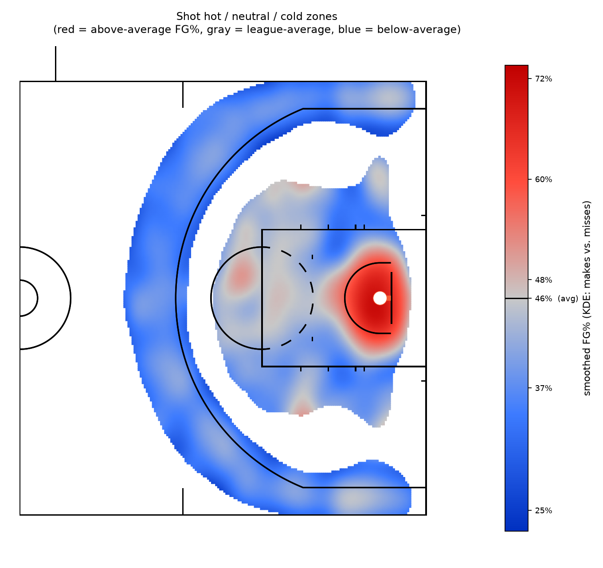
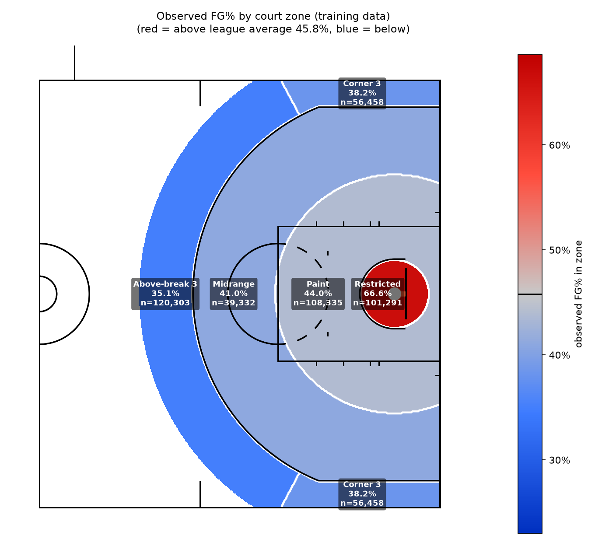
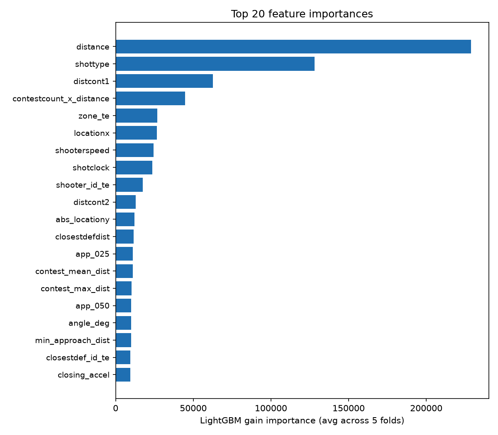
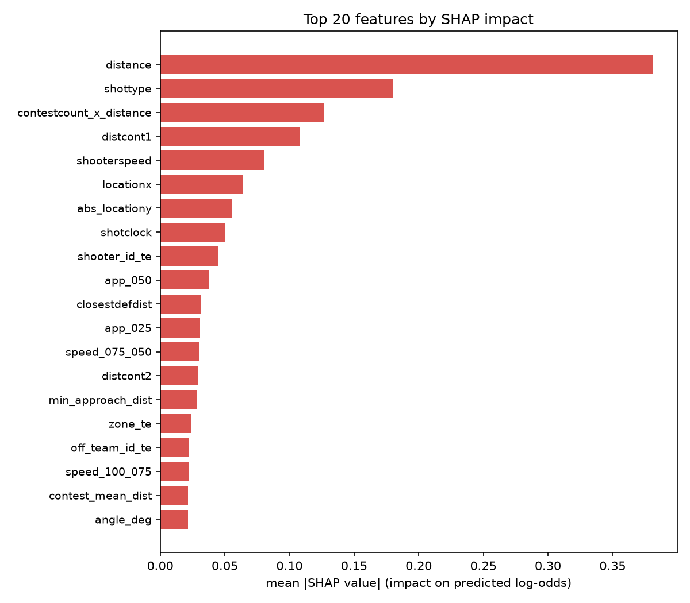
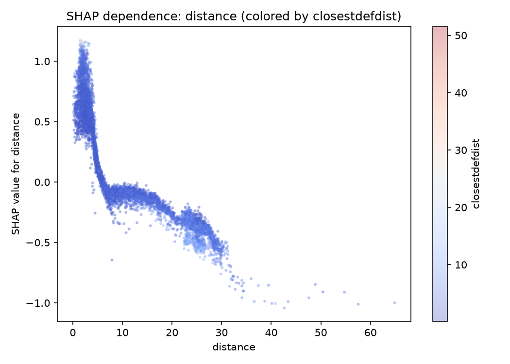
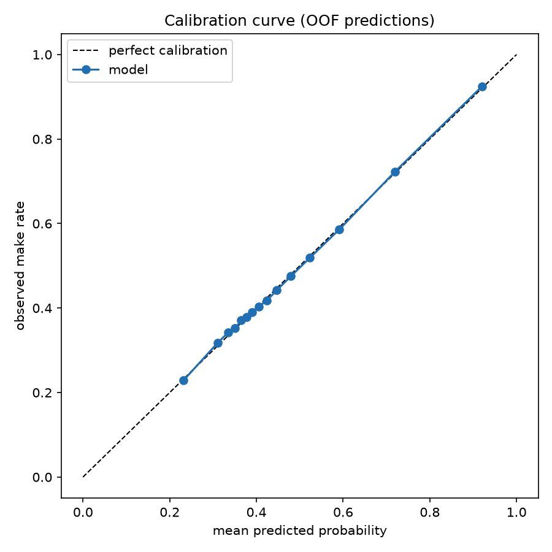

# Analyst Intern Project

Welcome to the next phase of the hiring process: a technical project. Please read `Analyst Intern Project Brief.pdf` for instructions.

**Make sure you press "Submit Project"** in the email once you are finished and have committed all requisite files to the main branch.

We recommend cloning this repository to your machine. See the guide [here](https://docs.github.com/en/repositories/creating-and-managing-repositories/cloning-a-repository) if you need help.

**Do not unzip** the training/testing `.csv.gz` files. You can read them in directly with the following:
- R:
  ```
  library(readr)
  train_df <- read_csv("training.csv.gz")
  ```
- Python:
  ```
  import polars as pl
  train_df = pl.read_csv("training.csv.gz")
  ```

---
<div align="center">


# Predicting NBA Shot Make Probability

### Analyst Intern Technical Project &nbsp;·&nbsp; Oklahoma City Thunder

**Bogdan Khudoidodov** &nbsp;·&nbsp; Candidate #0806

<br>


</div>

---

> **Task.** Given player-tracking data for an NBA field goal attempt — where it came from, who was
> guarding it, how fast that defender was closing, how much clock was left — estimate the
> probability that it goes in. Scored on **log-loss**.

---

## Required submission files

Everything the brief asks for sits at the top level of this repository:

| File | What it is |
| :--- | :--- |
| **[`project_code.py`](project_code.py)** | The complete pipeline — parsing, feature engineering, cross-validated modeling, diagnostics, submission |
| **[`submission.csv`](submission.csv)** | `make_prob` for all 213,977 test shots, in the template's original row order |
| **[`project_writeup.pdf`](project_writeup.pdf)** | The 10-page writeup: methodology, findings, figures, reflections |
| **[`ai_prompts.md`](ai_prompts.md)** | Log of AI prompts used during the project |

---

## Headline result

| Model | OOF log-loss | Δ vs. naive |
| :--- | ---: | ---: |
| Naive baseline (constant = training FG%) | 0.68963 | — |
| Logistic regression + natural cubic splines | 0.63420 | −8.0% |
| **LightGBM, 5-fold bagged** &nbsp;**←&nbsp;submitted** | **0.62425** | **−9.5%** |
| Blend (LightGBM + LogReg) | 0.62425 | optimal weight on LightGBM = 1.00 |
| *Season holdout:* train `fe055` → validate `2676a` | 0.62981 | |
| *Season holdout:* train `2676a` → validate `fe055` | 0.62528 | |

The blend search returned **w = 1.00** — the logistic model carried no information LightGBM
hadn't already absorbed. Rather than force it into the ensemble for the sake of saying
"ensemble," it stays in the repository as an interpretable baseline and a sanity check on the
feature engineering.

---

## The shot chart

Rather than trust five hand-drawn buckets, FG% is estimated **continuously** across the floor: a
2D Gaussian KDE is fit separately on made and missed shot locations, then combined into a local
make-rate surface, `make_density / (make_density + miss_density)`, and drawn on a real
[`sportypy`](https://github.com/sportsdataverse/sportypy) NBA half-court — which happens to use
the exact same real-world foot coordinates as this dataset (hoop 5.25 ft off the baseline).
Regions with too few nearby attempts to estimate honestly are left blank instead of extrapolated.

<div align="center">

</div>

Red is above the 45.8% league average, gray is at it, blue is below. The restricted area burns;
a thin cold crescent traces the arc and the deep wings. No basketball knowledge was injected —
this is what 425,719 shots look like when you let them speak.

The same geometry, bucketed into the five zones the model actually uses as a feature:

<div align="center">

</div>

| Zone | Attempts | FG% |
| :--- | ---: | ---: |
| Restricted area | 101,291 | **66.6%** |
| Paint | 108,335 | 44.0% |
| Midrange | 39,332 | 41.0% |
| Corner three | 56,458 | 38.2% |
| Above-the-break three | 120,303 | 35.1% |

A clean monotonic decay from the rim outward — and only the restricted area clears the 45.8%
league average. Zone boundaries in the figure aren't drawn by hand: a fine grid of court points
is pushed through the *same* `add_zone()` function the model uses, so every colored region is
literally what that feature means.

---

## The finding that shaped everything

Before a single model was trained, I intersected the IDs in `training.csv.gz` and `testing.csv.gz`:

```
training  →  425,719 shots   ·   season_id ∈ {fe055, 2676a}
testing   →  213,977 shots   ·   season_id ∈ {d7a2d}          ← never appears in training
teams     →  30 / 30 overlap
shooters  →  536 / 566 test shooters seen in training
```

**The test season is completely disjoint from training.** Two consequences follow immediately:

1. `season_id` **cannot** be used as a feature. At inference time it would always be an unseen
   category — the model would have learned nothing usable about it.
2. The textbook move here — Group K-Fold by season — is not meaningful with only **two**
   training groups.

So the validation strategy was rebuilt around that constraint:

- **Primary:** 5-fold Stratified K-Fold on `outcome`, with the *identical* split reused for both
  target encoding and model training.
- **Generalization check:** train on one season, validate on the other. This directly measures
  the degradation under a season shift — the same shift `testing.csv.gz` represents.

Average season-holdout log-loss is **0.62755**, about 0.5% worse than the in-sample CV estimate.
I expect the true test score to land nearer the holdout number than the CV number, and I'd rather
say that out loud now than explain an unexpected leaderboard gap later.

---

## Feature engineering

<table>
<tr><td width="33%" valign="top">

**Shot geometry**

Distance and angle recomputed to the rim center `(-41.75, 0)` from raw coordinates. The
recomputed distance matched the supplied `distance` column to within ~1e-5 ft — pure floating
point noise, confirming the coordinate system was read correctly before anything was built on
top of it.

</td><td width="33%" valign="top">

**Defender closeout dynamics**

`closestdefapproach` is a 4-point distance trace (1.0s, 0.75s, 0.5s, 0.25s pre-release). With
`closestdefdist` that's a 5-point time series, from which: per-segment closing speeds, closing
**acceleration**, the minimum distance reached, and a **recovery gap** — release distance minus
closest approach — that separates a defender who stayed attached from one who got beaten and is
scrambling back.

Only ~43% of sequences close monotonically. The rest are shooters creating separation. This is
real movement, not a static number copied four times.

</td><td width="33%" valign="top">

**Out-of-fold target encoding**

Shooter, closest defender, offensive team, defensive team and zone are encoded by their mean
outcome with count-based smoothing toward the global mean, so a player with three attempts
doesn't masquerade as a 100% shooter.

The encoding reuses the **exact same fold split** as model training — a row's encoded value is
always derived only from the rows its own model fold saw. Get this subtly wrong and the leak
reappears invisibly.

</td></tr>
</table>

Plus order-independent contester aggregates (`contest_min/mean/max_dist`) alongside the raw
`distcont1..4` columns, and six basketball-motivated interactions — `distance × closestdefdist`,
`dribblesbefore × shotclock`, `num_contesters × distance`, `avg_closing_speed × distance`,
`shooterspeed × dribblesbefore`, `three × closestdefdist` — where the marginal effect of one
variable plausibly depends on another. A closing defender is decisive on a jumper and nearly
irrelevant on a dunk already in motion.

---

## Model

LightGBM, binary objective, 5-fold stratified CV with bagged test-time prediction.

```python
learning_rate      = 0.03
num_leaves         = 31
min_child_samples  = 150      # guards the high-cardinality encoded features
subsample          = 0.8      # (freq=1)
colsample_bytree   = 0.8
reg_alpha, reg_lambda = 0.1, 0.5
n_estimators       = 3000     # early stopping at 100 rounds per fold
```

Gradient-boosted trees because shot-make probability is driven by nonlinear, interacting effects;
because the contester columns are *structurally* missing (`distcont2` is null whenever
`num_contesters < 2`) and LightGBM handles that natively rather than through an imputation
fiction; and because it trains fast enough to do cross-validated ensembling honestly at this
data size.

---

## Diagnostics

<table>
<tr>
<td width="50%" align="center"></td>
<td width="50%" align="center"></td>
</tr>
<tr>
<td align="center"><sub><b>Gain importance</b>, averaged across 5 folds. <code>distance</code> dominates, then <code>shottype</code> and <code>distcont1</code>. The engineered <code>contestcount_x_distance</code> and the zone encoding both land top-5 — the feature engineering is adding signal, not decoration.</sub></td>
<td align="center"><sub><b>Mean |SHAP|</b> via LightGBM's native <code>pred_contrib</code>. Consistent ranking, with <code>shooterspeed</code> and <code>locationx</code> rising — features that matter less <i>often</i> but swing individual predictions hard.</sub></td>
</tr>
</table>

<table>
<tr>
<td width="50%" align="center"></td>
<td width="50%" align="center"></td>
</tr>
<tr>
<td align="center"><sub><b>The long two.</b> SHAP for <code>distance</code> falls smoothly outward — then visibly upticks around 22–28 ft before resuming its decline. The model recovered the three-point line's shot-value cliff <i>on its own</i>, having never been told it exists.</sub></td>
<td align="center"><sub><b>Calibration.</b> 15 quantile bins of out-of-fold predictions against observed make rate. Near-perfect across the full range — which is the whole game under log-loss, a metric that punishes confident-and-wrong without mercy.</sub></td>
</tr>
</table>

---

## Sanity checks against basketball reality

Every number below was computed *before* modeling, as a check that the data meant what I assumed:

| Shot type | Attempts | FG% |
| :--- | ---: | ---: |
| Dunk | 25,767 | 88.5% |
| Layup | 115,446 | 53.5% |
| Tip | 9,372 | 48.1% |
| Post | 14,774 | 45.4% |
| Floater | 27,700 | 41.7% |
| Jumper | 231,542 | 37.8% |
| Heave | 1,118 | 9.5% |

Overall FG% **45.8%** · 2PT **52.7%** vs 3PT **36.1%** · contested **43.8%** vs uncontested
**62.1%**. Nothing here surprises anyone who has watched a basketball game — which is exactly the
point. If dunks had come back at 40% I'd have been debugging, not modeling.

---

## Repository layout

```
.
├── project_code.py                  ← the pipeline: features → CV → models → figures → submission
├── submission.csv                   ← predictions for every test shot
├── project_writeup.pdf              ← the 10-page writeup
├── ai_prompts.md                    ← AI usage log
├── requirements.txt
│
├── training.csv.gz                  ← 425,719 shots · seasons fe055, 2676a
├── testing.csv.gz                   ← 213,977 shots · season d7a2d
├── Analyst Intern Project Brief.pdf
│
├── outputs/
│   ├── metrics_summary.json         ← every score in this README, machine-readable
│   ├── project_writeup.docx
│   └── figures/
│       ├── shot_hotcold_court.png
│       ├── zone_fgpct_court.png
│       ├── zone_fgpct.png
│       ├── feature_importance.png
│       ├── shap_bar.png
│       ├── shap_dependence.png
│       └── calibration.png
│
├── scripts/
│   ├── writeup_content.py           ← writeup text, single source for PDF + Word
│   └── build_writeup.py             ← renders project_writeup.pdf and .docx
│
└── assets/
    └── okc_logo.png
```

---

## Reproduce

```bash
git clone https://github.com/flatsoup/oklohoma-city-thunder.git
cd oklohoma-city-thunder

python -m venv .venv && source .venv/bin/activate     # Windows: .venv\Scripts\activate
pip install -r requirements.txt

python project_code.py        # trains, writes submission.csv + outputs/
python scripts/build_writeup.py   # optional: regenerates the PDF and DOCX
```

`RANDOM_STATE = 42` throughout; a clean run reproduces every figure and every number above.
Do **not** unzip the `.csv.gz` files — the pipeline reads them compressed.

---

## What I'd do with more time, or more data

- **Possession context.** Pick-and-roll vs. isolation vs. spot-up. Shot difficulty depends
  heavily on how the shot was *created*, and none of that is observable here.
- **Defender orientation.** The tracking data gives distance but not angle of approach relative
  to the shooter's sightline — a closeout from the blind side is a different shot than the same
  distance straight on.
- **Screens, assists, handedness, score margin, opponent rim protection on the floor.**
- **More seasons.** Many shooters carry modest attempt counts; more history would stabilize the
  per-player encodings and make a proper season-level Group K-Fold feasible.
- **Monotonic constraints** on `distance` and `closestdefdist`, so the model's marginal effects
  can never contradict basketball logic even in sparse corners of feature space — plus a full
  Optuna search. Both were out of scope for this project's time budget; both are the obvious
  next step.

---

<div align="center">
<br>

<br><br>
<sub><b>Bogdan Khudoidodov</b> &nbsp;·&nbsp; Analyst Intern Project &nbsp;·&nbsp; Candidate #0806</sub>
<br>
<sub>Built with Python, LightGBM, scikit-learn, and a healthy distrust of un-validated cross-validation.</sub>
<br><br>
</div>

